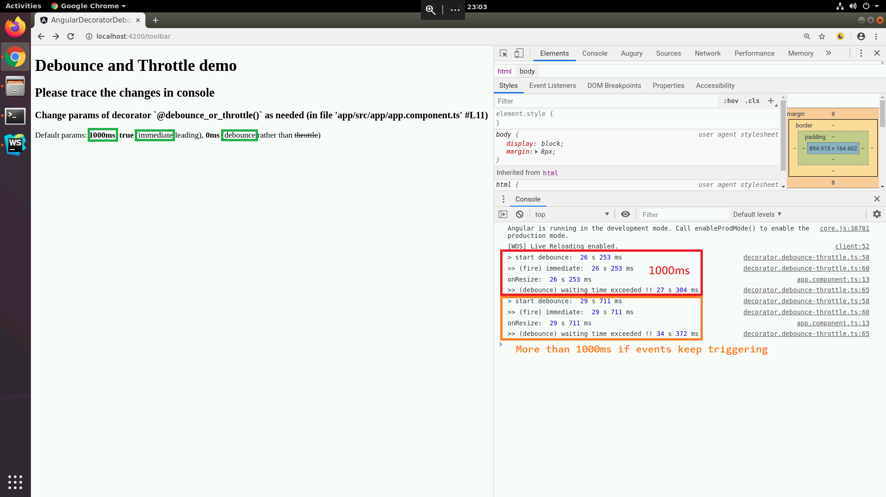
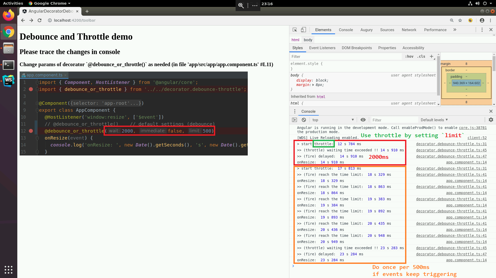

# Debounce and Throttle decorator for Angular
## - Angular Environment
[Angular@~8.2.14](./app/package.json#L17)

## - HOW-TO
### 1. Execute [`run_app.sh`](./run_app.sh)
```bash
./run_app.sh
```
  This script do:
  1. Check if folder `app/node_modules` exists, and run [`npm install`](./run_app.sh#L13) if not
  2. Move the `.ts` file [`decorator.debounce-throttle.ts`](./decorator.debounce-throttle.ts) into folder [`app/`](./app/) so that Angular is able to find it
  3. Run a tmp server on port 4200. Check it on [`http://localhost:4200/`](http://localhost:4200/)
### 2. Resize your window and check the log in consloe
* Look like this if using default setting (without giving params)
    
### 3. Change settings by passing parameters (e.g., use throttle rather than debounce)
* Change (or add) `@debounce_or_throttle(x, x, x)` in your own `*.component.ts`, e.g., [`app.component.html`](./app/src/app/app.component.ts#L11) in this demo
    

## - Reference
* Following [refs](./decorator.debounce-throttle.ts#L13-L16) help a lot when writing this decorator script
1. [Intro and examples for debouncing and throttling](https://css-tricks.com/debouncing-throttling-explained-examples/)
2. [Angular window resize event (@HostListener)](https://stackoverflow.com/a/35527852)
3. [Angular Debounce decorator example](https://plnkr.co/edit/3J0dcDaLTJBxkzo8Akyg?p=preview)
4. [Throttle implementation](https://kanboo.github.io/2018/05/03/JS-debounce-throttle)
### Bug fix
5. [TypeScript method decorator — 'this' with noImplicitThis enabled](https://stackoverflow.com/a/53847731)
  + These Q&As on stackoverflow help on fixing the bug: `this = undefined`
  + Fixed on [`#L23`](./decorator.debounce-throttle.ts#L23) & [`#L55`](decorator.debounce-throttle.ts#L55)
    - By adding `this` as the first arg (because arrow function not allow doing so, the name `_dummy` is given)

## - License
* This project is licensed under the MIT License  
  Feel free to modify it to your own version as needed
  + Remember to remove all [`console.log()`](decorator.debounce-throttle.ts#L31) before really using the decorator (at lines `#L31,33,41,45,47,58,60,65,67`)
  + Since this project is more for a demo rather than a production 
* I am the beginner of Angular, so feel free contact me if having any comments :D
